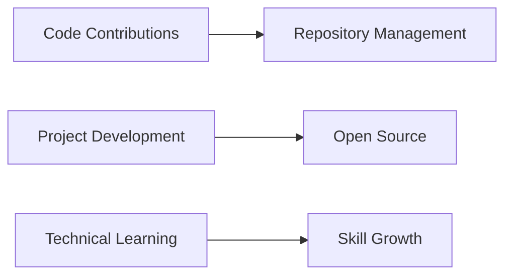

# 👋 Hi, I'm Elijah Mottey 

I'm a dedicated **Software Engineer** specializing in full-stack development and cloud technologies. With a strong foundation in both frontend and backend systems, I build scalable, efficient applications leveraging modern cloud infrastructure.

As an **AWS Certified Cloud Practitioner**, I combine development expertise with cloud architecture principles to deliver robust, production-ready solutions.

---

## 🛠️ Technical Expertise

<div align="center">

### 🎨 Frontend Development
| Technology | Proficiency | Use Case |
|------------|-------------|----------|
| **React** | Advanced | Component-based UIs |
| **Next.js** | Advanced | Full-stack applications |
| **TypeScript** | Intermediate | Type-safe development |
| **JavaScript** | Advanced | Dynamic web applications |
| **TailwindCSS** | Intermediate | Utility-first styling |

### ⚙️ Backend Development
| Technology | Proficiency | Specialization |
|------------|-------------|----------------|
| **Java** | Advanced | Enterprise applications |
| **Spring Boot** | Advanced | REST APIs & Microservices |
| **Python** | Intermediate | Scripting & Automation |
| **Flask** | Beginner | Lightweight web apps |

### 🚀 DevOps & Cloud
| Technology | Level | Application |
|------------|-------|-------------|
| **Docker** | Intermediate | Containerization |
| **Terraform** | Learning | Infrastructure as Code |
| **GitHub Actions** | Learning | CI/CD Pipelines |
| **AWS** | Certified | Cloud Solutions |
| **Git** | Advanced | Version Control |

</div>

---

## 🎯 Professional Focus

<div class="focus-grid" align="center">

| Area | Technologies | Status |
|------|--------------|--------|
| **Full-Stack Development** | Spring Boot + React/Next.js | 🚀 Active |
| **Cloud Infrastructure** | AWS, Terraform | 📚 Learning |
| **CI/CD Automation** | GitHub Actions, Docker | 🔄 Implementing |
| **Containerization** | Docker, Microservices | 🐳 Practicing |
| **Cloud Certification** | AWS Solutions Architect | 🎯 Pursuing |
| **System Optimization** | Data Structures & Algorithms | ⚡ Enhancing |

</div>

---

## 📊 GitHub Analytics

<div align="center">



</div>

<div align="center" style="display: flex; justify-content: space-between; flex-wrap: wrap; gap: 10px;">

<div style="flex: 1; min-width: 300px;">

</div>

<div style="flex: 1; min-width: 300px;">

</div>

</div>

<div align="center" style="margin-top: 20px;">

</div>

---

## 💼 Project Portfolio

### 🏨 **Hotel Management System**
```
📋 Description: Comprehensive hotel operations management platform
🛠️ Tech Stack: Spring Boot, React, MySQL, Docker, AWS RDS
🎯 Features: Booking system, billing, inventory management, reporting
📊 Status: Completed
```

### 🛒 **AgriCommerce Platform**
```
📋 Description: Digital marketplace for Ghanaian farmers
🛠️ Tech Stack: Spring Boot, React, PostgreSQL, AWS
🎯 Features: E-commerce, user management, payment integration
📊 Status: Deployed
```

### 📦 **Suggestion Box Application**
```
📋 Description: Enterprise feedback management system
🛠️ Tech Stack: Next.js, Spring Boot, Docker, GitHub Actions, Terraform
🎯 Features: Feedback collection, analytics, admin dashboard
📊 Status: In Development
```

### 📊 **E-Attendance System**
```
📋 Description: Role-based attendance tracking platform
🛠️ Tech Stack: Java, Spring Security, React, MySQL
🎯 Features: Real-time tracking, reporting, multi-role access
📊 Status: Completed
```

### ☁️ **AWS Infrastructure Labs**
```
📋 Description: Cloud architecture implementations
🛠️ Tech Stack: AWS Services, Terraform, GitHub Actions, CI/CD
🎯 Features: Infrastructure automation, deployment pipelines
📊 Status: Ongoing Learning
```

---

## 🏆 Certifications & Achievements

<div align="center">

### 🎖️ AWS Certified Cloud Practitioner
**Issuer**: Amazon Web Services  
**Date**: 2025  
**Status**: ✅ Active  
**Credential ID**: [View Badge](https://www.credly.com/badges/ea2dbf3c-c275-47b6-8970-22aae75a7762)

| Skill Area | Competency Level |
|------------|------------------|
| Cloud Concepts | ⭐⭐⭐⭐⭐ |
| AWS Services | ⭐⭐⭐⭐ |
| Security & Compliance | ⭐⭐⭐⭐ |
| Billing & Pricing | ⭐⭐⭐⭐ |

</div>

---

## 📞 Connect With Me

<div align="center">

| Platform | Link | Best For |
|----------|------|----------|
| **LinkedIn** | [elijah-mottey](https://linkedin.com/in/elijah-mottey) | Professional Networking |
| **GitHub** | [elijahmottey](https://github.com/elijahmottey) | Code Collaboration |
| **Email** | [elijahmottey5@gmail.com](mailto:elijahmottey5@gmail.com) | Direct Communication |

</div>

---

<div align="center">

> 🚀 *"Engineering solutions that bridge technical excellence with real-world impact through cloud-native architectures and scalable systems."*

**📅 Currently Available For:** Freelance Projects • Technical Collaborations • Learning Opportunities

</div>

---

